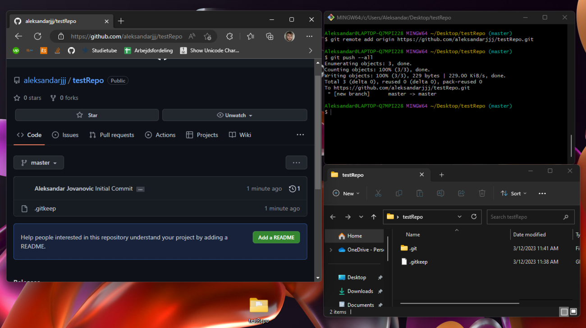

# Hvordan man bruger Git

1.Ved at benytte 'Git Bash here...' åbnes en kommandoprompt, der ser ud som følgende:

2. 'Git Bash' svare til Windows kommandoprompten 'cmd', og de ses her side om side.
   'Git' kan det samme som 'cmd' med et ekstra VCS (Version Control System) lag oveni, der kan styre såkaldte 'repositories',
   hvilket er en samling af filer, der løber kan trackes og opdateres. Det vil sige, at flere forskellige brugere kan hente,
   ændre, fjerne eller tilføje filer.

